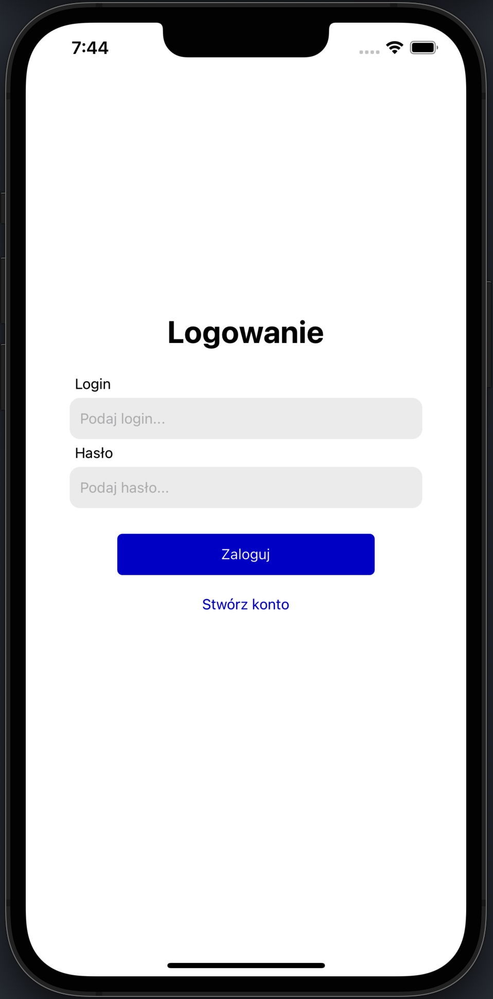
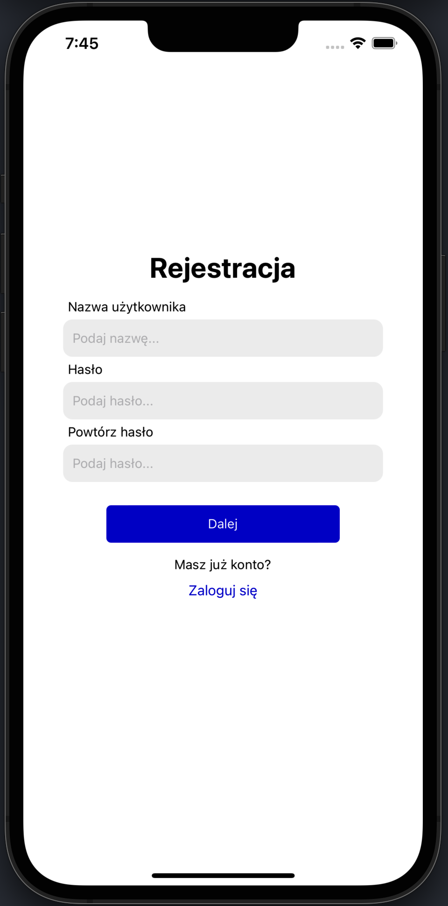
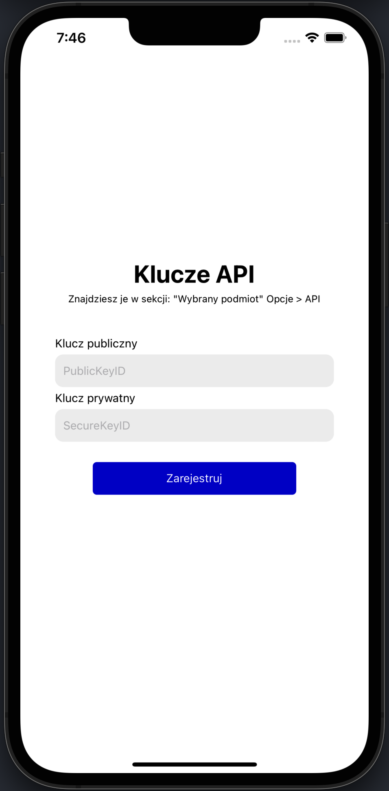
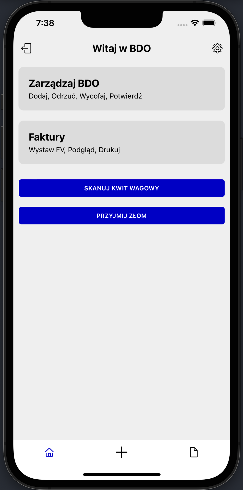
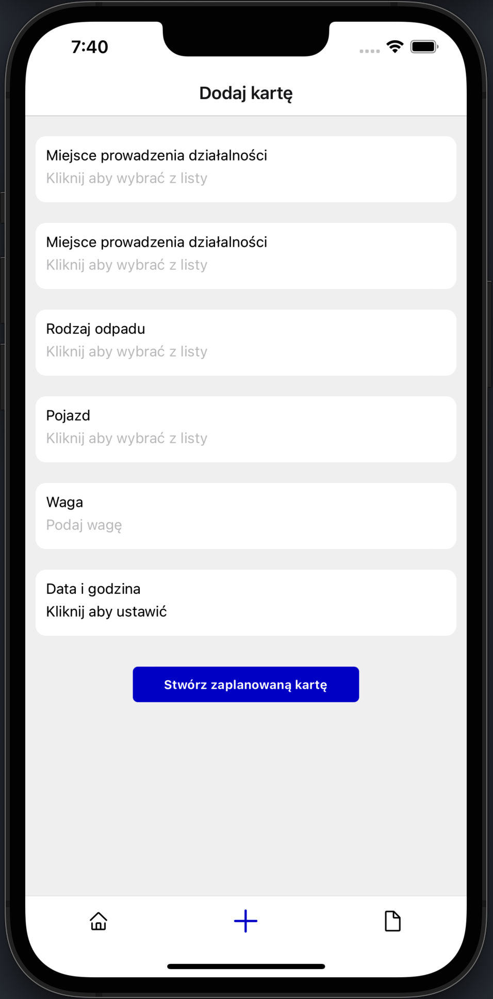
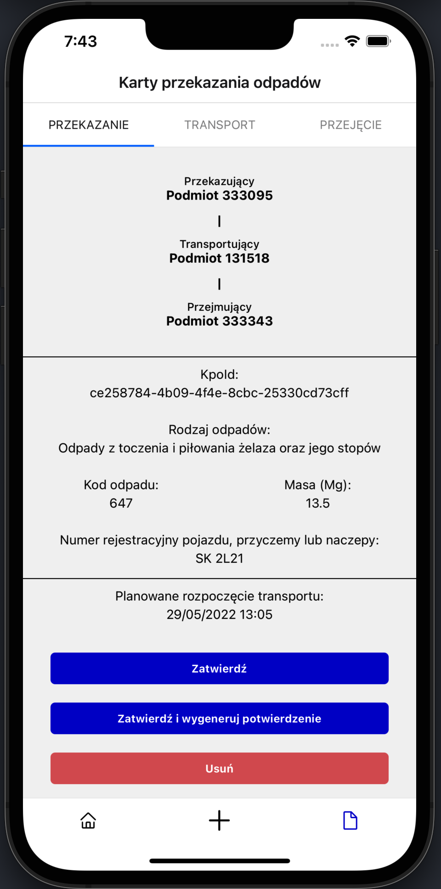
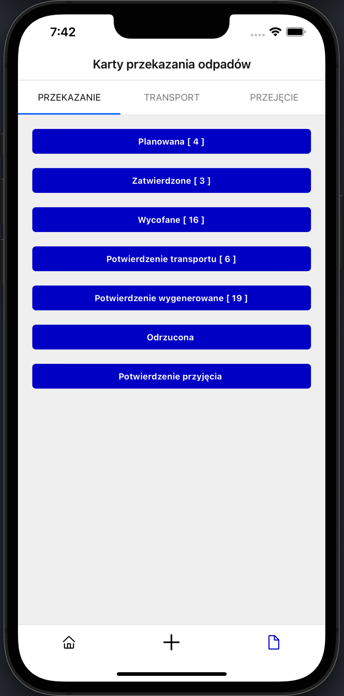
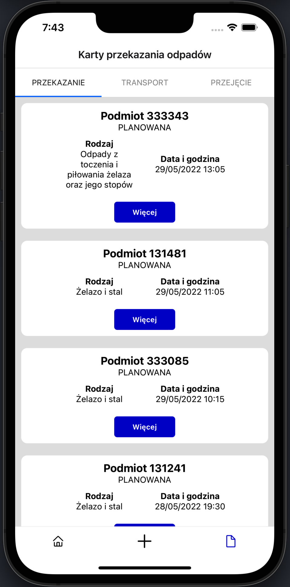

### Application created to automate internal processes for a scrap metal trading company. 
#### Help to manage waste cards in a simple and fast way in the  [BDO system](https://bdo.mos.gov.pl/)
#### File APK [here](/apk).

# 📸 Screenshots
| Login | Register | Add API Keys | Home |
| --- | --- | --- | --- |
|  |  |  |  |

##
| Create Card | Details Card | Cards Status | Cards List  |
| --- | --- | --- | --- |
|  |  |  |  |

# App functions
## for KPO Card
✅ Create Card \
✅ Confirm Card \
✅ Confirm Transport \
✅ Confirm Received \
✅ Generate Confirmation \
✅ Delete Card \
✅ Withdraw Card \
✅ Correct the Card \
✅ Reject Card \
✅ Print Confirmation \
✅ Print Card

#### 🛠 ToDo 
- [x] Login
- [x] Registration
- [x] Card management
- [ ] Automated custom print server ( on RPI )
- [ ] Notification of new cards
- [ ] User custom settings
- [ ] Invoice management

# Setup
```
$ git clone https://github.com/RederAc3/BDO.git
$ cd BDO
$ yarn install

# for iOS
$ cd ./ios && pod install && cd ..
$ yarn run ios

# for Android
$ yarn run android

```
